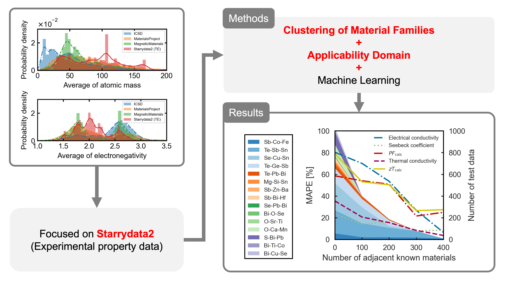

# matCL-knnAD

## Table of Contents
- [matCL-knnAD](#matcl-knnad)
	- [Table of Contents](#table-of-contents)
	- [Introduction](#introduction)
	- [Prerequisites](#prerequisites)
	- [Installation](#installation)
	- [Examples](#examples)
	- [How to cite](#how-to-cite)
	- [How to contribute](#how-to-contribute)
	- [Funding support](#funding-support)
	- [Author](#author)
	- [License](#license)

<a name="intro"></a>
## Introduction
Materials informatics (MI) research, which is the discovery of new materials through machine learning (ML) using large-scale material data, has attracted considerable attention in recent years. However, in general, the large-scale material data used in MI are biased owing to differences in the targeted material domains. Moreover, most studies on MI have not clearly demonstrated the influence of data bias on ML models. In this study, we clarify the influence of data bias on ML models by combining the concept of the applicability domain and clustering for large-scale experimental property data in the Starrydata2 material database previously developed by our group.



<a name="install"></a>
## Prerequisites
* Docker
* Docker Compose

## Installation
Run the following commands in a terminal.
```sh
cd YOUR_WORKSPACE
git clone https://github.com/kumagallium/matCL-knnAD.git
cd matCL-knnAD
docker-compose build
docker-compose up
```

<a name="example"></a>
## Examples
You can open jupyterlab by accessing the following URL.

http://127.0.0.1:8889/lab


<a name="cite"></a>
## How to cite
Please cite the following work if you want to use matCL-knnAD.

```
@article{kumagai2022effects,
  title={Effects of data bias on machine-learning--based material discovery using experimental property data},
  author={Kumagai, Masaya and Ando, Yuki and Tanaka, Atsumi and Tsuda, Koji and Katsura, Yukari and Kurosaki, Ken},
  journal={Science and Technology of Advanced Materials: Methods},
  volume={2},
  number={1},
  pages={302--309},
  year={2022},
  publisher={Taylor \& Francis}
}
```

<a name="contrib"></a>
## How to contribute
1. Fork it (`git clone https://github.com/kumagallium/matCL-knnAD.git`)
2. Create your feature branch (`git checkout -b your-new-feature`)
3. Commit your changes (`git commit -am 'feat: add some feature'`)
4. Push to the branch (`git push origin your-new-feature`)
5. Create a new Pull Request
   
<a name="fund"></a>
## Funding support
This work was supported by JSPS KAKENHI Grant Number JP20K22466.

<a name="author"></a>
## Author
This software was primarily written by Assistant Professor Masaya Kumagai at Kyoto University. 

<a name="license"></a>
## License
This codes are released under the MIT License.